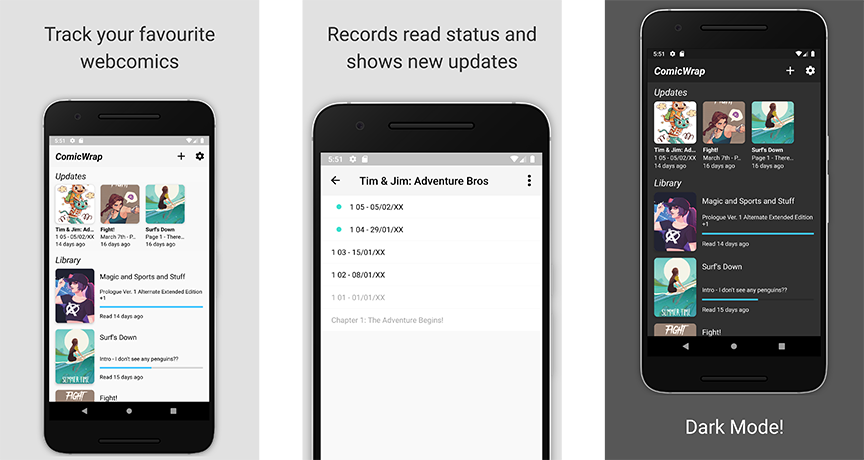

# ComicWrap

ComicWrap is an open source webcomic reader and tracker for Android and iOS. It is intended for reading webcomics that are published on their own websites.



<a href='https://play.google.com/store/apps/details?id=com.jackvine.comicwrap&pcampaignid=pcampaignidMKT-Other-global-all-co-prtnr-py-PartBadge-Mar2515-1'></a> | [Public Test with iOS TestFlight](https://testflight.apple.com/join/w5hTSp9W)

#### Main Idea: No Piracy

This app is not intended to scrape comic websites. Instead, comics are read directly on the website like a normal web browser. This ensures that the app does not have a negative effect on things such as ad revenue for the webcomic creator.

Why not just use a web browser?

This app provides some extra features:
  - Collecting your library in one place
  - Tracking what pages you've read
  - Notifying when a new page has been released (planned)

## Status

[](https://jackvine.visualstudio.com/ComicWrap/_build/latest?definitionId=1&branchName=master)

| Stage | Shared | Android | iOS |
| --- | --- | --- | --- |
| Test | [](https://jackvine.visualstudio.com/ComicWrap/_build/latest?definitionId=1&branchName=master) | `N/A` | `N/A` |
| Build | `N/A` | [](https://jackvine.visualstudio.com/ComicWrap/_build/latest?definitionId=1&branchName=master) | [](https://jackvine.visualstudio.com/ComicWrap/_build/latest?definitionId=1&branchName=master) |

## Building Locally

Add a new file called `secrets.json` to `ComicWrap\ComicWrap` with the following contents:

``` json
{
    "AppSecret_Android": "",
    "AppSecret_iOS": ""
}
```

We use [Mobile.BuildTools](https://github.com/dansiegel/Mobile.BuildTools) for injecting secrets at build time. The build will fail if any keys are missing, you can leave the values blank.

## Contributing

### Code

Pull requests are welcome! For major changes, please open an issue first to discuss what you would like to change.

Coding conventions generally adhere to the [Microsoft C# Coding Conventions.](https://docs.microsoft.com/en-us/dotnet/csharp/programming-guide/inside-a-program/coding-conventions)

### Localisation

We use [POEditor](https://poeditor.com/) as our localisation platform, due to their generous free plan for open source projects.

Want to help out? [Become a contributor here!](https://poeditor.com/join/project/PkakOxtZhA)

## License

[GNU General Public License v3.0](https://github.com/jackv24/ComicWrap/blob/master/LICENSE)

---

Google Play and the Google Play logo are trademarks of Google LLC.